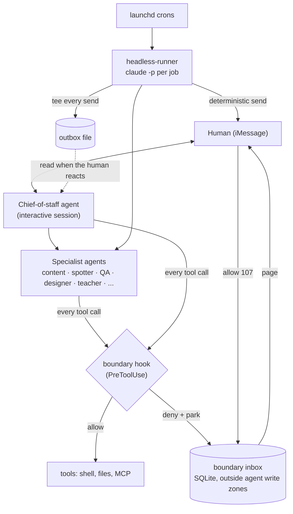

# agent-fleet-patterns

Working patterns from a personal fleet of about ten Claude-based agents that
run unattended on one Mac: a chief of staff, a content/brand agent, an intel
spotter, a QA agent, a designer, a teacher, and a few others. They run as
headless Claude Code sessions (`claude -p`) on launchd schedules, use MCP
servers for tools, and talk to me over iMessage.

The model calls were the easy part. The hard parts were getting agents the
right context, keeping what they said true, and deciding where an agent stops
and a human has to approve. This repo pulls out the three pieces I'd reuse,
sanitized, with tests.

## Architecture



Every agent has its own directory, charter, and PreToolUse hook. Scheduled
jobs never send from inside a model session. They draft, and a shell step
sends. Anything outward-facing that isn't pre-approved is denied and parked
for me to approve from my phone.

## The three patterns

### [`boundary/`](boundary): the governed-agent boundary

**Problem.** Headless agents run with permission prompts off, so a hook is the
only control on what they can do. Regex tripwires on shell commands work until
an agent writes around them.

**Design.** A PreToolUse hook classifies each call by riskclass (READ /
WRITE_LOCAL / EXEC / EXTERNAL) and path zone, and denies outward actions by
default. Denied calls go to an idempotent SQLite inbox (dedupe per exact call,
first responder wins). My approval mints a single-use grant bound to the hash of
that exact call, with a TTL. Audit rows are redacted. The store sits outside
every agent's write zone.

**Lesson.** An agent can rewrite its own guardrail with
`python3 -c 'open(".claude/hooks/escalate.sh","w")...'`, because the write
target is hidden in a code string that no hook can parse. The fix is to fail
closed: inline interpreter code is denied as `opaque-write`. The same audit
found that the approval CLI was itself reachable as a plain `python3 script`
call.

### [`headless-runner/`](headless-runner): reliable cron-driven `claude -p`

**Problem.** A daily job has to run exactly once, never make things up, never
double-send, and never lose an item when something fails.

**Design.** Lock and same-day guard, then a deterministic fetch, then the model
(facts only, no tools, with a timeout), then a deterministic grounding gate,
then a deterministic send. State is promoted only after a confirmed send.
Every send is teed to an outbox.

**Lessons.** "Sent" doesn't mean delivered. The messaging transport returned
timeouts on messages that had actually arrived, so a blind retry meant a
double-send. Now a failed send is checked against the source of truth before
anything is retried. Drafts occasionally stated numbers that weren't in the
input, hence the gate. And crons message me without the live session knowing,
so every send is teed to an outbox file that the chief-of-staff agent reads
when I reply to something it didn't send.

### [`spotter/`](spotter): profile-driven intel engine

**Problem.** Several recipients want daily intel on different topics, and I
didn't want a separate codebase for each.

**Design.** One engine, one YAML profile per recipient. Items are routed into
weighted beats (co-occurrence groups, word-boundary terms), scored on
relevance, engagement, and recency, with an optional negativity lean that can
read app-review star ratings. Seen-state handles dedup, and each source gets a
trust multiplier learned from what the human actually acts on.

**Lesson.** Freshness belongs in the score, not in a filter. Filtering on it
dropped good items on slow days. And dedup has to key on canonical identity,
because tracking parameters made the same item look new every day.

## Rules that became code

- **No autonomous publishing.** Content agents draft and a human approves. The
  hook denies publish, send, and push tools, plus browser interaction tools
  (typing, clicking, uploading), for any agent that only drafts. The approval
  gate is enforced in code, not written in a charter and hoped for.
- **Verify before claiming something is broken.** Agents carried forward
  beliefs like "the X integration is down" from an earlier session and told me
  to go fix something that had already recovered. Now an agent runs a live
  check before telling me a dependency is broken or asking me to act on it.
- **Store the approval state where agents can't write.** If an agent can edit
  the file that says what it's allowed to do, you don't have a boundary.

## What I'd do differently

- **Start with the deny-by-default riskclass table,** not regex tripwires.
  I built tripwires first and kept patching false positives in both
  directions: `git checkout` read as a payment, `python3 --version` read as
  inline code.
- **Put the grounding check in code from day one.** I relied on prompt rules
  for too long.
- **Build one runner, not N forks.** Each cron started as a copy of the last
  one's shell script, and fixes (the locale bug, the stale lock) had to be
  ported by hand. A shared template with per-job config would have prevented
  that.
- **Authenticate the approver.** `--by owner` is an asserted identity, and
  what protects it is that agents can't reach the tool. A signed token from
  the phone relay would be stronger.
- **Make everything observable early.** The async audit logger silently
  recorded about 1,700 blank rows before anyone looked. An audit trail nobody
  queries is an audit trail that's broken.

## Running the tests

```sh
bash boundary/tests/boundary.test.sh         # 96 cases
bash boundary/tests/hook.test.sh             # 59 cases
bash headless-runner/tests/runner.test.sh    # 48 cases
python3 -m unittest discover -s spotter/tests   # 18 cases
```

Requirements: bash 3.2+, python3, jq, sqlite3, PyYAML (spotter only). The tests
use temp directories and fakes, need no network, and don't call a real model.

MIT licensed.
